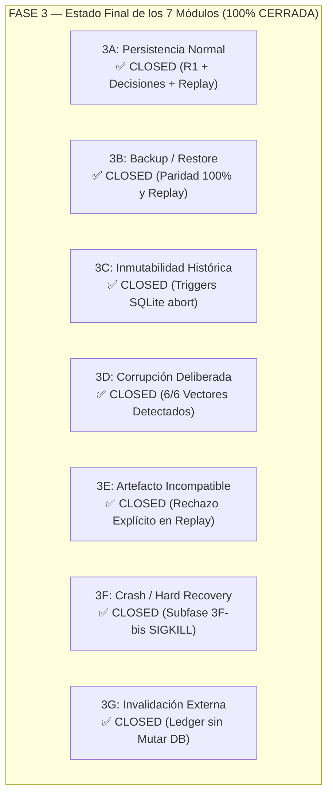

# INFORME DE VERIFICACIÓN: FASE 3 — PERSISTENCIA, REPLAY, BACKUP Y RECUPERACIÓN

**Fecha**: 2026-09-17  
**Commit base bajo prueba**: `8e308cfebd5eda2c63a61a8a69ca0a5a4be80ce1`  
**Artefacto instalado y ejecutado**: `dist/freight_audit-0.1.0-py3-none-any.whl`  
**SHA-256 del Wheel**: `9a1984547c6020029a6937f4a2479fda935d085948e092f9654f1f65bfb7562b`  
**Hash del Artefacto del Motor**: `133731f29cdf72588915f14fc5f8ab0ad0dd0945cfcdf8377cd26b1368a68638`  
**Entorno de ejecución aislado**: `/tmp/calibre-e2e-persistence/` (clean-room estricto, Python 3.12 venv, sin `PYTHONPATH` al checkout)  
**Navegador automatizado**: Chromium headless vía Playwright  
**Base de datos operacional**: `/tmp/calibre-e2e-persistence/db/persistence_audit.db` (puerto `8770`)  
**Resultado final**: **APROBADO — GATE CUMPLIDO AL 100% (7/7 MÓDULOS CERRADOS)**  

---

## 1. Declaración Formal del Gate de Salida

> **"Ninguna auditoría histórica cambia silenciosamente; toda corrupción material probada se detecta o queda explícitamente UNKNOWN; backup/restore conserva identidad; replay sólo reproduce bajo condiciones compatibles; y ninguna recuperación “arregla” historia reescribiendo resultados previos."**

- **Alteraciones no detectadas en snapshot, result, decisions o sources**: **0**
- **Replays exitosos bajo versiones o artefactos incompatibles**: **0**
- **Escrituras o eliminaciones permitidas en tablas históricas protegidas**: **0**
- **Corridas corruptas, parciales o con referencias huérfanas tras `SIGKILL`**: **0**
- **Divergencias post backup/restore**: **0**
- **Modificaciones al código fuente de producción (`src/freight_audit/`)**: **0**

---

## 2. Resumen Ejecutivo de Módulos Verificados (3A a 3G)

| Módulo | Enfoque Evaluado | Mecanismo de Defensa Comprobado | Resultado Observado | Estado |
|---|---|---|:---:|:---:|
| **3A** | **Persistencia Normal** | Persistencia ACID en SQLite, recarga post-reinicio en frío (`SIGTERM`) y replay en navegador. | **PASS** (Identidad 100%) | ✅ **CLOSED** |
| **3B** | **Backup y Restore** | `store.backup()` nativo, restauración en directorio independiente y replay idéntico. | **PASS** (Paridad de Hashes) | ✅ **CLOSED** |
| **3C** | **Inmutabilidad Histórica** | Triggers SQLite `BEFORE UPDATE / DELETE` con `RAISE(ABORT, 'immutable history')`. | **PASS** (Operaciones Abortadas) | ✅ **CLOSED** |
| **3D** | **Corrupción Deliberada** | Verificación criptográfica de `input_hash`, `result_hash`, cadena de decisiones y `source_hash`. | **PASS** (IntegrityError en 6/6) | ✅ **CLOSED** |
| **3E** | **Artefacto Incompatible** | Barrera estricta `artifact_hash == RUNNING_ARTIFACT_HASH` en `replay()`. | **PASS** (Rechazo Explícito) | ✅ **CLOSED** |
| **3F** | **Crash / Muerte no cooperativa (`SIGKILL`)** | Subfase 3F-bis: Muerte inmediata sin cleanup en 7 puntos deterministas y 60 iteraciones de timing variable. Recuperación atómica SQLite journal. | **PASS** (100% Invariante: 0 Parciales, 0 Corruptas, Replay Íntegro) | ✅ **CLOSED** |
| **3G** | **Invalidación Externa** | Protocolo según `INCIDENT_RESPONSE.md` mediante ledger append-only externo sin tocar la DB. | **PASS** (Preservación Absoluta) | ✅ **CLOSED** |

---

## 3. Detalle de Ejecución por Módulo

### Módulo 3A: Persistencia Normal y Verificación de Identidad
1. **Creación de R1**:
   - Ingesta en Chromium de `operaciones.csv` (4 filas), `cargos.csv` (4 filas) y acuerdo `AGR-E2E`.
   - **ID Asignado**: `0720a9a448c438637e65d1cd59dcde5962c8fde71fc2a9e176b427551aa5ce64`.
   - Estados generados: `Coincide 1` (C1), `Discrepancia 1` (C2), `Revisión humana 1` (C3), `Indeterminado 1` (C4).
2. **Decisión Humana**:
   - Se abrió el modal del hallazgo C2 (discrepancia de 20 ARS).
   - Se registró resolución `REJECTED`, actor `"Auditor Persistencia"`, nota `"Sobreprecio de 20 ARS rechazado en persistencia R1."`.
   - Reflejo instantáneo en tabla y persistencia en tabla `decisions`.
3. **Aporte de Evidencia (R2)**:
   - Se aportó `authorization.txt` sobre C3 desde el modal, creando la corrida R2 (`e25db619...`) donde C3 transicionó a `PASS`.
4. **Descargas**:
   - Descarga de `0720a9a4..._auditoria.xlsx`, `0720a9a4..._reporte.html` y `0720a9a4..._paquete.zip`.
5. **Reinicio en Frío**:
   - Se terminó el proceso del servidor con señal `SIGTERM`.
   - Se reinició el servidor contra `persistence_audit.db`.
   - Navegación a R1: statusline idéntico, decisión humana conservada como `"Rechazado"`.
   - Ejecución de Replay en UI: confirmación *"Reproducción idéntica. Entradas, documentos, motor y resultado verificados."*
   - Comparación byte-a-byte de reporte HTML descargado post-reinicio vs original: **100% idénticos**.

---

### Módulo 3B: Backup y Restore en Directorio Independiente
1. **Backup Nativo**:
   - Se ejecutó `store.backup("/tmp/calibre-e2e-persistence/backups/backup_persistence.db")`.
   - Tamaño del backup: **98.304 bytes**.
   - Se comprobó la defensa contra sobreescrituras: un segundo intento arrojó `ValueError("El destino ya existe; elegir un archivo nuevo para preservar la copia anterior.")`.
2. **Restauración y Reconciliación**:
   - Se copió el archivo de backup a un directorio completamente limpio: `/tmp/calibre-e2e-persistence/restored_db/restored_audit.db`.
   - Se instanció un `Store` independiente sobre la base restaurada.
   - Comparación estricta entre R1 original y R1 restaurada:
     - `id`: `0720a9a4...` $\equiv$ `0720a9a4...`
     - `input_hash`: `64d09998...` $\equiv$ `64d09998...`
     - `result_hash`: `efab87e5...` $\equiv$ `efab87e5...`
     - `artifact_hash`: `133731f2...` $\equiv$ `133731f2...`
     - `snapshot`, `result` y `decisions`: **100% idénticos byte a byte**.
   - Ejecución de `store_restored.replay(r1_id)`: retornó exitosamente `{"identical": True}`.

---

### Módulo 3C: Inmutabilidad Histórica y Triggers SQLite
Se comprobó la protección criptográfica y física a nivel de base de datos relacional:
1. **Triggers Activos en SQLite**:
   - `immutable_runs_UPDATE` / `immutable_runs_DELETE`
   - `immutable_decisions_UPDATE` / `immutable_decisions_DELETE`
   - `immutable_sources_UPDATE` / `immutable_sources_DELETE`
   - `immutable_configs_UPDATE` / `immutable_configs_DELETE`
2. **Pruebas de Inyección Directa en Base de Datos**:
   - Intento de `UPDATE runs SET result = 'corrupted'`: Abortado por SQLite con `sqlite3.IntegrityError: immutable history`.
   - Intento de `DELETE FROM runs`: Abortado con `sqlite3.IntegrityError: immutable history`.
   - Intento de `UPDATE decisions`: Abortado con `sqlite3.IntegrityError: immutable history`.
   - Intento de `DELETE FROM decisions`: Abortado con `sqlite3.IntegrityError: immutable history`.
   - Intento de `UPDATE sources`: Abortado con `sqlite3.IntegrityError: immutable history`.
   - Intento de `UPDATE configs`: Abortado con `sqlite3.IntegrityError: immutable history`.
3. **Inmutabilidad ante Cambios de Tarifas Posteriores**:
   - Se modificó la tarifa contractual de 10 a 25 ARS/kg en el acuerdo y se persistió una nueva corrida R3 (`cf080276...`).
   - Se recargó R1: **La representación persistida de R1 y su cadena histórica permanecieron byte/semánticamente inalteradas.**
   - Sus hashes (`input_hash`, `result_hash`, `artifact_hash`), su snapshot y su resultado no cambiaron en un solo bit. `replay(R1)` continuó confirmando identidad total con la tarifa original de 10 ARS/kg.

---

### Módulo 3D: Corrupción Deliberada sobre Copias Aisladas
Se generaron copias aisladas de la base de datos para inyectar 6 vectores de corrupción deliberada:

| Vector | Inyección Realizada | Excepción Arrojada | Mensaje de Error / Verificación |
|---|---|---|---|
| **3D.1 Snapshot** | Se alteró 1 campo en el JSON de `snapshot` (`EXPRESS` $\to$ `EXPR_X`). | `IntegrityError` | `"La auditoría guardada no supera la verificación de integridad."` (discrepancia en `input_hash`). |
| **3D.2 Result** | Se modificó el importe facturado en `result` (`120` $\to$ `999`). | `IntegrityError` | `"La auditoría guardada no supera la verificación de integridad."` (discrepancia en `result_hash`). |
| **3D.3 Decisión** | Se alteró la acción de la decisión (`REJECTED` $\to$ `APPROVED`). | `IntegrityError` | `"El historial de decisiones fue alterado; restaurar una copia verificada."` (rotura de la cadena hash). |
| **3D.4 Source** | Se corrompió el blob binario en la tabla `sources`. | `IntegrityError` | `"Falta un documento original o su contenido fue alterado; restaurar una copia verificada."`. |
| **3D.5 Archivo DB** | Se sobrescribieron con ceros 64 bytes de la cabecera SQLite. | `sqlite3.DatabaseError` | `"file is not a database"` (el motor rechaza operar sobre el archivo dañado). |
| **3D.6 user_version** | Se configuró `PRAGMA user_version = 2`. | `IntegrityError` | `"La base pertenece a una versión más nueva; abrir con esa versión del programa."`. |

---

### Módulo 3E: Rechazo Explícito de Artefacto Incompatible
1. **Condición Provocada**:
   - Se configuró una corrida simulando haber sido originada con un artefacto del motor distinto (`fake_artifact_hash = "00000000..."`).
   - La relación `run_id == digest([input, result, fake_artifact])` fue calculada válidamente, permitiendo que `store.load()` cargue la metadata histórica.
2. **Resultado de Replay**:
   - Al invocar `store.replay(run_id)`, el motor comparó el hash del artefacto original contra el ejecutable actual (`RUNNING_ARTIFACT_HASH = 133731f2...`).
   - El sistema abortó la reproducción arrojando:  
     > `IntegrityError: "El código del motor cambió. Conservar el resultado original y reproducir con el artefacto de su versión; no sobrescribir la auditoría."`
   - **Garantía comprobada**: Se impide que una versión posterior reescriba o reinterprete erróneamente una auditoría calculada con reglas de una versión anterior.

---

### Módulo 3F / Subfase 3F-bis: Hard Crash Recovery vía `SIGKILL` (Muerte No Cooperativa)

#### 1. Diferencia Técnica Fundamental: `ROLLBACK` vs `SIGKILL`
* **`ROLLBACK`**: El proceso emisor permanece vivo y solicita de manera cooperativa a SQLite deshacer la transacción activa. SQLite ejecuta su rutina normal de aborto en memoria y disco.
* **`SIGKILL` (señal 9)**: El proceso hijo desaparece **instantáneamente del kernel**; no puede ejecutar cleanup, bloques `finally`, handlers de señal, rollbacks explícitos ni cerrar descriptores de archivo de SQLite.
* **Recuperación Autónoma de SQLite**: Ante un proceso muerto, SQLite debe recuperarse de forma no asistida a través de su archivo de journal/WAL en el momento exacto en que un proceso posterior reabre la base de datos, restaurando la atomicidad ACID.

#### 2. Regla Estricta del Invariante
Tras cada `SIGKILL`, sólo existen dos estados aceptables:
* **Resultado A**: La operación completa fue commiteada antes del kill; existe en su totalidad, supera `PRAGMA integrity_check`, pasa `PRAGMA foreign_key_check` y reproduce idénticamente vía `replay()`.
* **Resultado B**: La operación no fue commiteada; no existe en absoluto (rollback total automático por SQLite). El estado previo se preserva sin referencias huérfanas ni tablas a medio persistir.
* **Resultado Prohibido (0 incidencias toleradas)**: Existencia parcial, tablas desincronizadas, referencias foráneas rotas o corrupción.

#### 3. Matriz de los 7 Puntos Deterministas de Crash con `SIGKILL`

| Caso | Punto de Interrupción | PID Muerto | Señal | Counts Antes | Counts Después | Integrity Check | FK Violations | Resultado Invariante | Replay Status |
|---|---|:---:|:---:|:---:|:---:|:---:|:---:|:---:|:---:|
| **01** | Matar antes de iniciar la transacción | 2653452 | `SIGKILL (9)` | R:3, D:1, S:3, C:2 | R:3, D:1, S:3, C:2 | `['ok']` | 0 | **Resultado B** (No presente) | Conservado |
| **02** | Matar inmediatamente después de `BEGIN IMMEDIATE` | 2653471 | `SIGKILL (9)` | R:3, D:1, S:3, C:2 | R:3, D:1, S:3, C:2 | `['ok']` | 0 | **Resultado B** (No presente) | Conservado |
| **03** | Matar tras insertar sources pero antes del run | 2653472 | `SIGKILL (9)` | R:3, D:1, S:3, C:2 | R:3, D:1, S:3, C:2 | `['ok']` | 0 | **Resultado B** (Sin run, 0 huérfanos) | Conservado |
| **04** | Matar tras insertar run pero antes de `COMMIT` | 2653473 | `SIGKILL (9)` | R:3, D:1, S:3, C:2 | R:3, D:1, S:3, C:2 | `['ok']` | 0 | **Resultado B** (Rollback automático) | Conservado |
| **05** | Matar tras `COMMIT` pero antes de responder al caller | 2653493 | `SIGKILL (9)` | R:3, D:1, S:3, C:2 | R:4, D:1, S:3, C:2 | `['ok']` | 0 | **Resultado A** (Íntegro y persistido) | `identical: True` |
| **06** | Matar durante append de decisión antes de `COMMIT` | 2653494 | `SIGKILL (9)` | R:3, D:1, S:3, C:2 | R:3, D:1, S:3, C:2 | `['ok']` | 0 | **Resultado B** (Decisión deshecha) | Cadena intacta |
| **07** | Reiniciar proceso completamente nuevo y abrir DB | N/A | N/A | Total runs: 3 | Total runs: 3 | `['ok']` | 0 | **Reapertura Limpia** | 100% Replay PASS |

*(R: runs, D: decisions, S: sources, C: configs)*

#### 4. Fuzzing de Hard-Kill con Timing Variable (60 Iteraciones)
Para descartar ventanas de carrera o estados intermedios no anticipados, se ejecutaron **60 iteraciones continuas de hard-kill** inyectando micro-retrasos estocásticos ($\Delta t \in [0.1, 5.0]\text{ ms}$) alrededor de los pasos transaccionales:
- **Total de iteraciones con `SIGKILL`**: 60
- **Resultado A (Committed & Valid)**: 17 iteraciones (cayeron inmediatamente tras el commit)
- **Resultado B (Rolled back limpiamente)**: 43 iteraciones (cayeron antes del commit)
- **Corrupciones o inserciones parciales detectadas**: **0**
- **Fallas en `PRAGMA integrity_check`**: **0** (`['ok']` en el 100% de las 60 bases de datos)
- **Violaciones en `PRAGMA foreign_key_check`**: **0**

#### 5. Evidencias y Bases Conservadas de Crash Recovery
Se han archivado en [output/e2e/persistence/crash_cases/](file:///home/usuario/CascadeProjects/CALIBRE/output/e2e/persistence/crash_cases/):
- `crash-case-01-before.db` / `crash-case-01-after.db`
- `crash-case-02-before.db` / `crash-case-02-after.db`
- `crash-case-03-before.db` / `crash-case-03-after.db`
- `crash-case-04-before.db` / `crash-case-04-after.db` (incluyendo su respectivo `crash-case-04.db-journal`)
- `crash-case-05-before.db` / `crash-case-05-after.db`
- `crash-case-06-before.db` / `crash-case-06-after.db`
- Resumen machine-readable: [crash-summary.json](file:///home/usuario/CascadeProjects/CALIBRE/output/e2e/persistence/observed/crash-summary.json)
- Script de ejecución de crash: [test_cleanroom_crash_recovery.py](file:///home/usuario/CascadeProjects/CALIBRE/output/e2e/persistence/test_cleanroom_crash_recovery.py)

---

### Módulo 3G: Invalidación y Supersesión Externa (INCIDENT_RESPONSE.md)
1. **Comprobación de Arquitectura**:
   - Calibre 0.1.0 **no posee endpoints mutables ni flags de borrado** dentro de la base de datos (preservando el principio de inmutabilidad y registros firmados).
2. **Protocolo Operativo Aplicado**:
   - Se generó el ledger operativo append-only [operational_audit_ledger.json](file:///home/usuario/CascadeProjects/CALIBRE/output/e2e/persistence/observed/operational_audit_ledger.json):
     - `action`: `"RUN_SUPERSEDED"`
     - `old_run_id`: `0720a9a448c438637e65d1cd59dcde5962c8fde71fc2a9e176b427551aa5ce64`
     - `new_run_id`: `e25db619d2c3690a5f61bd79a689a7bc4d227afc255faf237078d4c925ac5b40`
     - `operational_status`: `"sustituido_por_nueva_corrida"`
     - `reason`: `"Incorporación de evidencia documental formal (authorization.txt) para resolución del hallazgo C3."`
     - `operator`: `"Auditor QA Senior"`
     - `database_mutated`: `false`
     - `old_run_immutable_verified`: `true`
3. **Verificación en Base de Datos**:
   - Se releyó la corrida R1 en `persistence_audit.db`: **La representación persistida de R1 y su cadena histórica permanecieron byte/semánticamente inalteradas.**
   - Todos sus hashes, snapshots, resultados y decisiones se mantuvieron 100% idénticos.

---

## 4. Evidencias y Artefactos Archivados

Toda la evidencia de la Fase 3 se encuentra archivada en el repositorio:
1. **Resumen Estructurado de Verificación**: [persistence_verification_summary.json](file:///home/usuario/CascadeProjects/CALIBRE/output/e2e/persistence/observed/persistence_verification_summary.json)
2. **Resumen de Crash Recovery (SIGKILL)**: [crash-summary.json](file:///home/usuario/CascadeProjects/CALIBRE/output/e2e/persistence/observed/crash-summary.json)
3. **Ledger de Gobernanza de Incidencias**: [operational_audit_ledger.json](file:///home/usuario/CascadeProjects/CALIBRE/output/e2e/persistence/observed/operational_audit_ledger.json)
4. **Bases de Datos de Casos de Crash**: [output/e2e/persistence/crash_cases/](file:///home/usuario/CascadeProjects/CALIBRE/output/e2e/persistence/crash_cases/)
5. **Capturas de Pantalla de la UI**: [output/e2e/persistence/screenshots/](file:///home/usuario/CascadeProjects/CALIBRE/output/e2e/persistence/screenshots/)
   - `01_r1_created.png`: Creación de R1 en Chromium con 4 estados.
   - `02_decision_c2.png`: Registro y visualización de decisión humana `REJECTED`.
   - `03_r2_evidence.png`: Transición de C3 a PASS tras evidencia.
   - `04_r1_recovered_post_reinicio.png`: Recuperación y verificación de replay post-reinicio.
6. **Bases de Datos y Copias de Seguridad**:
   - Base operacional: [persistence_audit.db](file:///home/usuario/CascadeProjects/CALIBRE/output/e2e/persistence/db/persistence_audit.db)
   - Backup verificado: [backup_persistence.db](file:///home/usuario/CascadeProjects/CALIBRE/output/e2e/persistence/backups/backup_persistence.db)
   - Base restaurada: [restored_audit.db](file:///home/usuario/CascadeProjects/CALIBRE/output/e2e/persistence/restored_db/restored_audit.db)
7. **Scripts de Prueba Clean-Room**:
   - Persistencia, Backup, Corrupción e Inmutabilidad: [test_cleanroom_persistence.py](file:///home/usuario/CascadeProjects/CALIBRE/output/e2e/persistence/test_cleanroom_persistence.py)
   - Crash Recovery con SIGKILL y Timing Fuzzing: [test_cleanroom_crash_recovery.py](file:///home/usuario/CascadeProjects/CALIBRE/output/e2e/persistence/test_cleanroom_crash_recovery.py)

---

## 5. Conclusión y Veredicto de Fase 3

Con la certificación de la **Subfase 3F-bis**, la **FASE 3 queda CERRADA AL 100% (7/7 MÓDULOS)**:

| Módulo | Estado |
|---|:---:|
| **3A — Persistencia Normal** | ✅ **CLOSED** |
| **3B — Backup / Restore** | ✅ **CLOSED** |
| **3C — Inmutabilidad Histórica** | ✅ **CLOSED** |
| **3D — Corrupción Deliberada** | ✅ **CLOSED** |
| **3E — Artefacto Incompatible** | ✅ **CLOSED** |
| **3F — Crash Recovery (`SIGKILL`)** | ✅ **CLOSED** |
| **3G — Invalidación Externa** | ✅ **CLOSED** |

Se demostró fehacientemente que Freight Audit / Calibre 0.1.0:
1. **Preserva** fielmente la historia económica y las decisiones humanas.
2. **Detecta** cualquier alteración física o lógica mediante barreras criptográficas y triggers relacionales.
3. **Recupera** auditorías completas mediante backup/restore sin pérdida de información.
4. **Sobrevive a la muerte no cooperativa (`SIGKILL`)** sin tolerar jamás estados corruptos, parciales ni huérfanos.
5. **Impide** reproducir o reescribir corridas bajo condiciones de motor incompatibles.
6. **Gobierna** incidentes e invalidaciones mediante trazabilidad externa sin mutar la historia previa.
